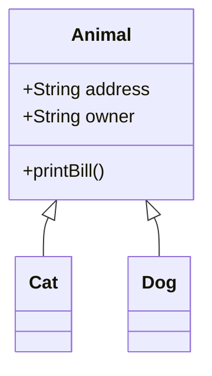
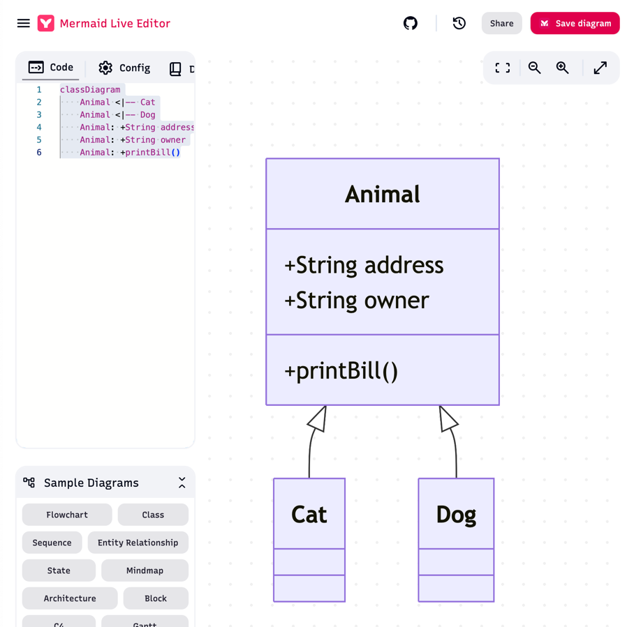

# Task 3
Draw a UML class diagram placing the following classes in an appropriate inheritance
- hierarchy :- Cat, Dog and Animal.
- Add the following attributes:- owner, address
- And methods:- print bill

Mermaid:

