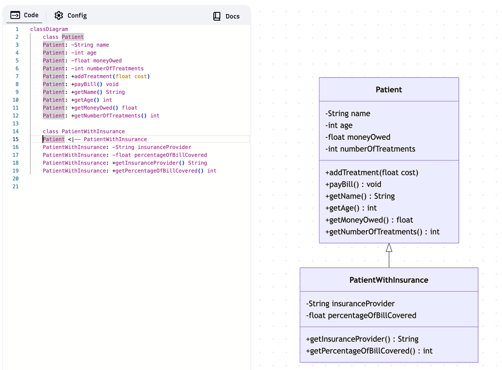
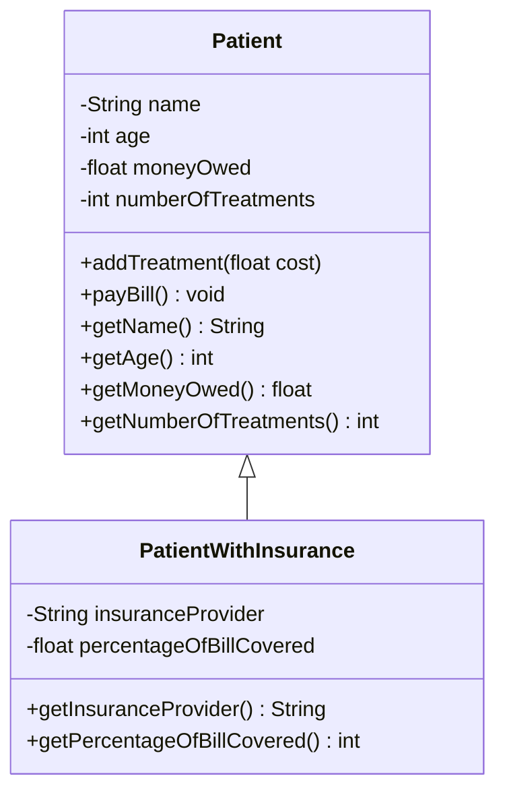

## Task 4
A private hospital billing system requires a class to store the details of patients and the amount of money
charged to them for treatments carried out. For each patient the system should store the following
details:
- Patient’s name
- Patient’s age
- Amount owed to the hospital
- Number of treatments they have received

It should also provide functionality to:
- Add a treatment for a specified cost
- Pay the bill (this will notify the user how much is to be payed and reduce the amount owed to 0)

Some patients are insured for their treatment and additional information is required for this category of
patients:
- The name of the insurance company
- The percentage of the bill that will be covered by the insurance company.

Additional functionality is also required for insured patients:
Charge the insurance company for their percentage of the bill (thus reducing the amount owed).

Draw a UML class diagram which models the system described above.

### Mermaid
